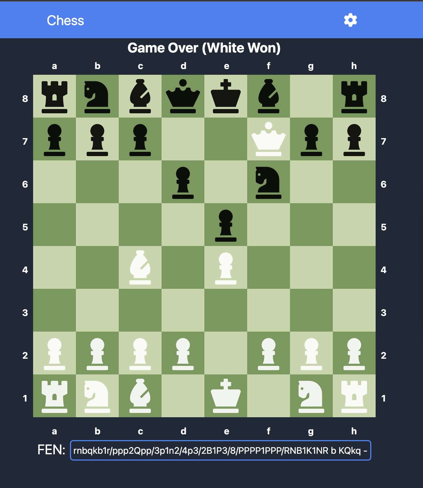
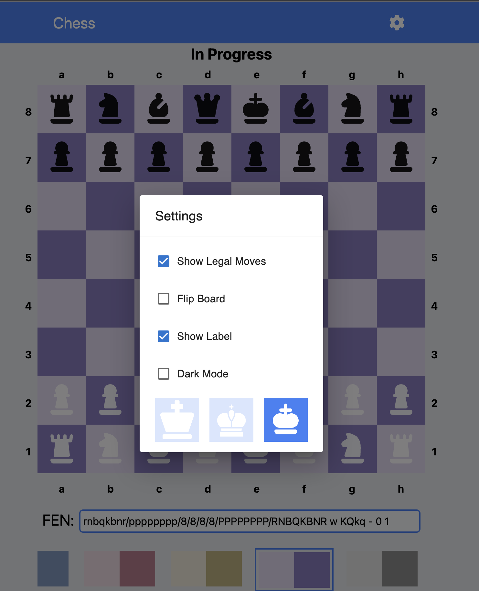

# Chess Game

## How to Play

This chess game is implemented using Rust WebAssembly (Wasm) for the logic and React with TypeScript for the frontend. Here are some key features and options you can explore while playing:

- [x] **En Passant**: Explore the en passant rule in chess, allowing a pawn to capture another pawn that has just moved two squares forward.

- [x] **Castling**: Learn how to perform castling, a special move involving the king and a rook that can help improve your position.

- [x] **Illegal Moves**: Watch out for illegal moves! The game ensures that all moves adhere to the rules of chess.

- [x] **Check and Checkmate**: Experience the thrill of putting your opponent's king in check and striving for checkmate.

- [x] **Themes**: Customize the game's visual theme to your liking. Try out different themes to enhance your gaming experience.
- [x] **Highlight Legal Moves**: Legal moves will be highlighted for you, making it easier to plan your strategies and explore your options.

Enjoy your chess game adventure, and may you achieve victory on the board!
